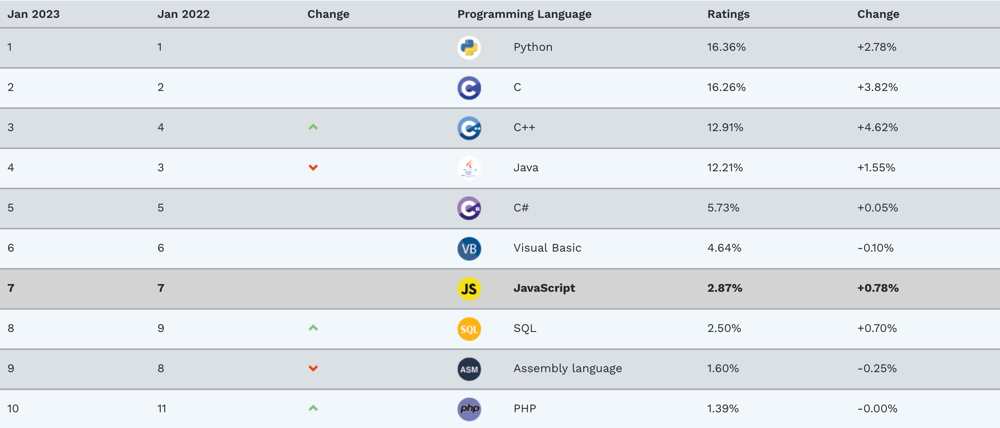

---
title: 为什么要学Python
---

2020年，欧洲太空署（European Space Agency）打算向火星派出一个探测器，把一些岩石样品带回地球，以检测火星上是否存在生命。受燃料限制，探测器只能带回500g的火星岩石。因此，只有精心挑选的样本才能被带回地球。科学家们准备构建一个现场挑选器，这个挑选器必须有视觉重建能力，为此他们构建了一个人工神经网络。在这项任务中，无论是构建神经网络和多CPU集群，还是通过PyCUDA来使用NVida的CUDA库，都重度依赖Python。

{: .img-center-75}

_图片来源: [mars-rover-space-traveler]_

第一个登陆火星的编程语言，是Java。它作为勇气号（Spirit）探测器系统的一部分，于2004年1月4号着陆在火星上。而这一次，为了完成更复杂、更智慧的任务，科学家们选择了Python。

做出这个选择并不奇怪。实际上，随着人工智能的兴起，Python已成为当前最炙手可热的开发语言，其排名在编程语言最重要的排行榜 TIOBE[^TIOBE] 上逐年攀升：



不仅如此，自从 TIOBE 开始编制各种开发语言的排行榜以来，Python还分别于2021年、2020年、2018年、2010年和2007年五夺年度之星称号，这也是唯一五次获得该称号的开发语言：


此外，我们还可以从VS Code中Python语言扩展的下载次数（超过7500万次，对应C/C++是4200万次），Docker Hub下Python镜像的下载次数（超过10亿次，对应Java则只有1亿次）上看出来Python的受欢迎程度。


那么，Python是一门什么样的语言？它在开发上究竟有何优势，以至于能得到如此这般名声呢？我们常常听人说（尤其是在中文社区），Python不适合开发大型应用程序，这是真的吗？这本书将尝试回答这些问题，特别是从软件工程的角度，阐述应该遵循什么样的开发流程和规范，又要使用哪些工具和技巧，才能快速开发出复杂大型应用程序。

Python是一门有着悠久历史的开发语言，它由出生于荷兰的程序员Guido Van Rossum开发。Guido Van Rossum在国内被粉丝亲切地称作“龟叔”。从创立这门语言起的长达30年时间里，Guido Van Rossum一直以他的热情和热爱指引着这门语言的未来发展方向，被称作“仁慈的终身独裁者”（the benevolent dictator for life）。大约在2018年他有过一段短暂的退休，不过很快于2020年重新回归社区，加入微软并继续领导Python的开发。

Python的最初版本于1994年1月发布，甚至还要早于Java[^Java]。一开始它吸收了很多Lisp语言的特性，比如引入了函数式编程工具，其痕迹一直遗留到今天 -- 这就是现在仍然在广泛使用的`reduce`， `filter`， `map`等函数的出处。在那时，Perl还是一种非常流行的脚本语言， Python也从中吸收了很多成熟模块的功能，这样就成功地留住了一批寻找Perl的替换语言的用户。

Python 2.0发布于千禧年（2000年）。最重要的改变，不是2.0新增了哪些功能，而是流程和规范上的改变：首先，Python的开发者们迁移到了新的代码管理工具，之前他们使用的是CVS。这一工具因无法支持团队合作开发，已经严重降低了团队开发效率；其次，他们仿照RFC，做了一个PEP（Python 改进提案）计划，任何新增的功能和变动，都必须先经过PEP提出、评论和确认之后，才会正式纳入开发计划。正是这些改变，使得Python的发展走上了成功之路。

这一版在功能上的重大变化，是开始使用16位的Unicode字符串（注意这并不是我们现在常用的UTF-8编码），这使得Python得以走出英语文化圈，开始了国际化之路。

2001年底，Python 2.2发布，从而使得Python成为一门纯粹的面向对象的编程语言。这一段时间，Java在企业应用端开枝散叶，而Python则在数据和基础设施管理方面找到用武之地。

2008年，Python 3.0版本发布，因其与2.x完全不兼容（Python 2.7成为Python 2.x的最终版），成为Python历史上最具争议的一个版本，但也就此甩掉了长期以来积累的沉重包袱。此后Python轻装上阵，直到3.6版本开始，成为Python 3系列第一个比较稳定可靠的版本。也是在这个过程中，随着大数据、机器学习与人工智能的快速演进，Python进一步发挥出它的优势，被越来越多的人认识和使用。

Python是一门优雅迷人、易于学习和高效的开发语言。从一开始起，它就把优美易读，接近自然语言和易于开发作为第一目标，把编程的快乐重新还给开发者。在1999年，创始人Guido Van Rossum发起了一项名为CP4E(Computer Programming for Everybody)的运动，旨在让几乎所有人都能编写和改进计算机程序。这项运动的发起宣言在这里[^CP4E]。它写道，若干年前，施乐公司曾经提出了让每个桌面都摆上一台计算机的宏大愿景，这个愿景现在早已实现。但是，计算机还不够灵活。如果让每一个人都有能力为他们的计算机编程，会怎样？

这项运动的目标之一，就是为中学生设计一门编程语言课。我们看到，国内很多省已经开始要求中学生开始学习Python编程，可以说，这项运动的理念，潜移默化地，在世界范围内得到了认同。实际上，正是由于Python语言的简洁优美，接近自然语言、无须编译的特性，才使得CP4E的目标有可能实现。

如果说优雅迷人还有些主观的成分，毕竟每个人心中的女神可能不尽相同。但很少会有人不承认Python的简洁高效。“人生苦短，我用Python”不仅是一句口号，也是Python程序开发高效率的一个真实写照。

与其它开发语言相比，实现同样的功能，在不借助于函数库的前提下，Python代码始终是最简单、最易读的。如果在C、Java和Python三者间进行比较的话，Java是代码量最大的语言，要比C语言长1.5倍，而比Python则长3~4倍。我们以输出一个数组的元素为例来体验一下：

```python title="Python"
arr = ["Hello, World!", "Hi there, Everyone!", 6]
for i in arr:
    print(i)
```

```Java title="Java"
public class Test {
    public static void main(String args[]) {
        String array[] = {"Hello, World", "Hi there, Everyone", "6"};
        for (String i : array) {
          System.out.println(i);
        }
    }
}
```
仅看定义和输出数组元素值的那部分。两种语言都需要三行代码，但是Python的代码明显更短，更不要说Python还有所谓的“pythonic"的写法：
```python title="Python"
[print(i) for i in ["Hello, World!", "Hi there, Everyone!", 6]]
```

当然这么写还是有争议的，对一些人来说，它牺牲了可读性。

我们再看一个变量交换的例子：

```c title="C语言示例"
// C program to swap two variables in single line
#include <stdio.h>
int main()
{
	int x = 5, y = 10;
	//(x ^= y), (y ^= x), (x ^= y);
    int c;
    c = y;
    y = x;
    x = c;
	printf("After Swapping values of x and y are %d %d", x, y);
	return 0;
}
```

```Java title="Java示例"
class GFG {
	public static void main(String[] args)
	{
		int x = 5, y = 10;
		//x = x ^ y ^ (y = x);
        int c;
        c = y;
        y = x;
        x = c;
		System.out.println("After Swapping values"+" of x and y are " + x + " " + y);
	}
}
```

```python title="Python示例"
x, y = 5, 10
x, y = y, x
print("After Swapping values of x and y are", x, y)
```

Python的语法显然更简单，它就像我们每天使用的自然语言一样，似乎不借助任何复杂的技巧、甚至不需要懂所谓的编程知识，就能够实现这些功能。C和Java虽然也都能不借助第三个变量，实现一行代码完成变量的值交换，但这样的代码需要一定的技巧，因而容易出错。

简洁（但不需要借助于复杂的技巧）的代码显然更加容易阅读和理解，从而大大加快了开发的速度。的确，在这个信息过载的时代，简洁越来越显示出强大的力量：json取代xml成为更多人传递数据的工具；Markdown则取代了Html、reStructuredText和Word成为我们的文档格式。

删繁就简三秋树，标新立异二月花。繁琐、夸张的巴洛克艺术，无论其多么精致、多么吸引眼球，都无法在这个高度内卷的年代逃脱批判。我们需要那些能够成为我们直觉的工具、符号和思想，以便让我们能够快速响应这日益复杂的世界。

!!! Info
    简单即是美。这种哲学思想大致起源于奥卡姆。达芬奇也有类似的思想：“简单是极致的精巧”，尽管精巧才是那个时代的审美。如果你对这些思想感兴趣，可以进一步阅读John Maeda撰写的书籍《The Laws of Simplicity》。

语言的简洁、优美在Python中的地位是如此重要，以至于它被写进了Python“宪章” -- PEP20[^PEP20]： 

!!! Cite "Zen of Python -  by Tim Peters[^Tim_Peters]"     
    Beautiful is better than ugly.
    优美胜于丑陋

    Explicit is better than implicit.
    明了胜于晦涩

    Simple is better than complex.
    简单优于复杂

    Complex is better than complicated.
    复杂优于凌乱

    Flat is better than nested.
    扁平好过嵌套

    Sparse is better than dense.
    稀疏强于稠密

    Readability counts.
    可读性很重要！

    Special cases aren't special enough to break the rules.
    特例亦不可违背原则

    Although practicality beats purity.
    即使实用战胜了纯粹

    Errors should never pass silently.
    错误绝不能悄悄忽略

    Unless explicitly silenced.
    除非我们确定需要如此

    In the face of ambiguity, refuse the temptation to guess.
    面对不确定性，拒绝妄加猜测

    There should be one -- and preferably only one -- obvious way to do it.
    永远都应该只有一种显而易见的解决之道

    Although that way may not be obvious at first unless you're Dutch.
    即便解决之道起初看起来并不显而易见

    Now is better than never.
    做总比不做强

    Although never is often better than *right* now.
    然而不假思索还不如不做

    If the implementation is hard to explain, it's a bad idea.
    难以名状的，必然是坏的

    If the implementation is easy to explain, it may be a good idea.
    易以言传的，可能是好的

    Namespaces are one honking great idea -- let's do more of those!
    名字空间是个绝妙的主意，请好好使用！

这段文字甚至还以彩蛋的方式出现。如果执行以下的命令：

```bash
python -c 'import this'
```

就会输出上面的文字。任何时候，如果我需要引用《Zen of Python》，我都会使用这个方法。

PEP20还藏着另一个彩蛋。我们说它应该有20条规则，但实际上我们只能看到19条，这是为什么呢？

实际上，这第20条规则，是留给Guido的特权，多年来，社区一直在等待他来添加这一条规则。这也反映了社区对Guido的挚爱。不过，10多年过去了，迄今为止，Guido都没有使用这一特权，这第20条"军规"，也就一直空缺到现在。


其次，Python的高效，还体现在它无需编译即可运行上。象C，Java这样的编译型语言，如果你写完一小段程序，想看看它是如何运行的，你必须等待它完成编译 -- 这个时间可能是几十秒或者以分钟、甚至小时计 — 这将导致程序员的工作被打断。下面的讽刺漫画反映了这种情况：


而在Python中，你随时可以打开它的交互式界面(即IPython)，输入一小段代码，马上就看到它的运行结果。下图显示了如何在ipython界面下计算数学问题：


如果你不喜欢使用IPython这种命令行式的接口，也可以安装一个Jupyter Notebook来编写和运行一些Python代码片段。关于Jupyter Notebook，我们还会在介绍IDE时进一步介绍。此外，随手写一个Unittest，通过Unittest来测试你刚写的方法也会比其它语言来得更容易。因此，使用Python，你会发现学习和成长是如此容易！

最后，Python能成为一门高效开发语言，还得益于它庞大和活跃的社区。在Python世界里，你很容易发现一些造好的“轮子”，因此构建你的应用程序，就象搭积木一样简单。比如，有时候需要显示一些Html格式的文档，或者以Web的方式展现本地文件以供下载，我们就可以象下面一样简单地启动一个HTTP服务器：

```bash
python -m http.server
```

这样就启动了一个web服务器，它会列出命令启动时的文件夹目录，而你不需要安装和设置任何软件！

名满天下，谤亦随之。作为一种适合所有人使用的编程语言，Python在承载希望的同时，也承担了许多质疑。这些质疑中声量最大的，当属对Python性能和构建大型复杂应用程序能力的质疑。

诚然，Python与其它开发语言相比，在运行速度上确实要落后不少。某种程度上，这种落后甚至是有意为之，因为很长一段时间以来，Python之父并不认为需要过多地关注Python的性能问题，它已经足够快了。确实，对99%以上的任务来说，Python的性能是足够的，快到足够支撑早期的Google和Dropbox[^Dropbox] — 这是很多程序员一生都难以遇到的应用场景。从那个时候起，Python在性能上又有了长足的进步。不久前ChatGPT的问世，不仅告诉我们人工智能的语言模型可以有多先进，而且还告诉我们，Python也可以写出来高性能、高可扩展性的大型分布式计算平台 — Ray[^ray]。目前，这个平台已经支撑了超过1亿月活跃用户，我们还不知道这个平台的瓶颈在哪里。无论如何，我们恐怕再也不能说，Python不适合构建大型应用了吧？

但是人们也有理由要求Python运行得更快。毕竟，无论人们已经使用Python构建出了算力多么惊人的计算平台，但Python的单进程的计算能力，许多场景下仍然较多数语言来得慢。如果Python本身运行较慢，如果再加上应用程序的架构设计很糟糕的话，那么还是可能出现性能瓶颈的 — 需要指出的是，糟糕的应用程序架构是绝大多数应用产生性能瓶颈的原因，而不应该由开发语言来背黑锅。比如，很多人诟病Python的GIL（全局解释器锁）使得Python中无法充分利用多线程的优势。但实际上，在程序中使用多线程很多时候是个坏主意，你应该使用Coroutine和多进程来代替它，这样往往能达到更好的性能。

不过，在不远的将来，我们将再也不用为Python的性能问题担忧：在2021年5月的Python开发者峰会上，Guido已经宣布了一个计划，要在未来四年里，将Python的性能提升5倍甚至更多。我们不妨畅想一下，到那时，Ray会不会成为世界上算力最强的计算平台之一呢？

另一个问题，是关于Python是否适合大型复杂应用程序的开发。如果说对Python性能的质疑还有其事实依据，这个质疑则只能反映提问者对Python的开发缺乏了解。这些质疑具体地说，一是Python的动态类型特性，使得类型推断变得困难，这对代码的静态检查和重构十分不利；二是由于Python代码没有编译过程，因此就缺少了编译时检查这一发现错误的机制。

关于第一个质疑，Python从3.3起就引入了类型声明，因此只要代码遵循规范来编写，类型推断和代码重构就不是问题。Javascript就是明显的一例，它同样是动态语言，但引入类型提示之后升级为TypedScript语言，现在也非常成功。关于第二点，编译时检查只是增强代码质量的一种方案，而不是惟一的方案。检验代码质量的惟一标准，就是它运行时能否满足你的期望。这正是单元测试、集成测试所要做的事。由于Python的动态类型特征，使得构建Mock对象十分简单，因此单元测试也变得格外容易。这样会鼓励程序员更多地进行充分和全面的单元测试，从而极大地提高代码质量。

因此，在作者看来，一些人之所以质疑Python能否用以大型应用程序开发，更多地是因为他们并不了解和熟悉Python软件开发流程、规范和工具。实际上，如果遵循Python软件开发的最佳实践，用好规范和工具，使用Python开发大型应用程序，可以相当惊人地缩短开发时间，提高开发效率，也更容易取得商业上的成功。

[mars-rover-space-traveler]: https://pixabay.com/photos/mars-mars-rover-space-travel-rover-67522/

[^Java]: Java 1.0版本发布于1996年1月。Python创建于1991年的2月。
[^PEP20]: PEP是Python Ehancement Proposals的首字母缩写。它是将新特性引入Python的重要方式。
[^Tim_Peters]: Tim Peters是Python的重要贡献者之一，也是Timsort排序算法的发明人，这种算法被广泛使用于包括Python在内的各种语言，比如Chrome v8引擎和nodejs。
[^Dropbox]: Dropbox当时使用的是Python 2.x。Dropbox最终使用了其它语言改写了部分功能，原因是许多人认为，由Python 2升级到Python 3，不亚于换了一种语言。
[^CP4E]: CP4E运动：https://www.python.org/doc/essays/cp4e/
[^TIOBE]: https://www.tiobe.com/tiobe-index/
[^ray]: ChatGTP对算力的需求是惊人的。因此，他们使用了Ray这个Python写成的共享内存式分布式计算平台。Ray的开发者是Anyscale公司，由UC Berkeley的几位教授、以及Databricks的联合创始人共同成立。
