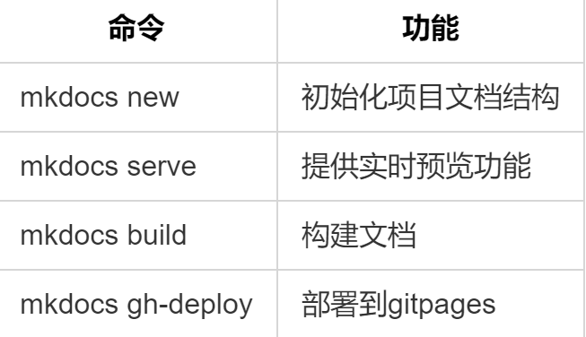
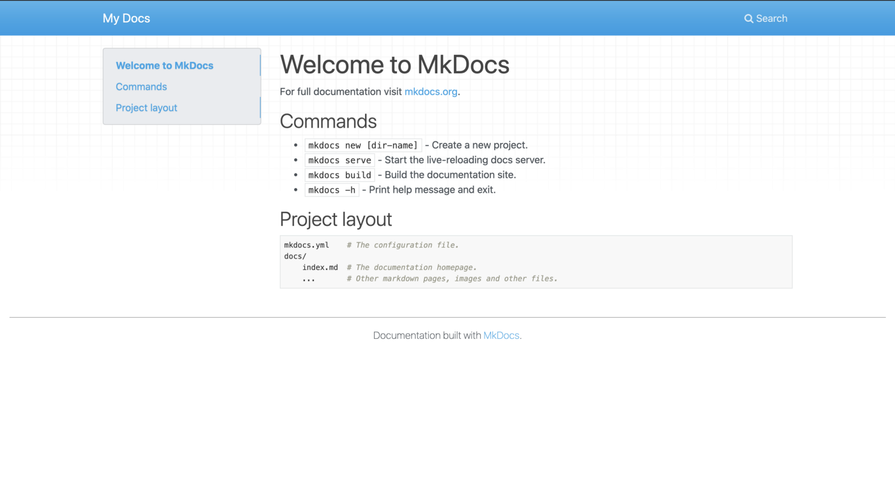
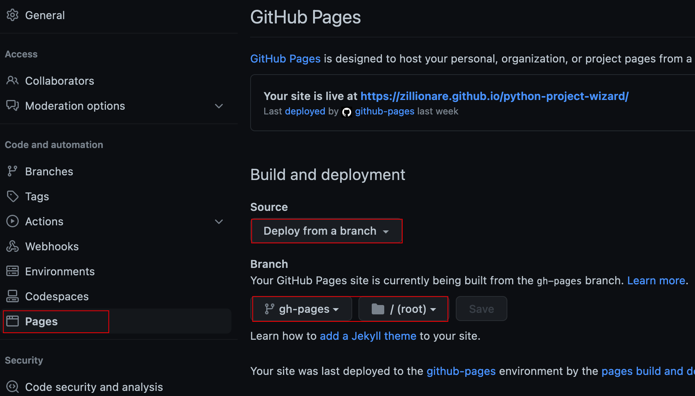

所有好的产品都应该有一份简洁易读的使用说明书，除了苹果。苹果用户天生就知道如何使用他们的产品，因此完全不需要文档。这是真的，几乎所有的苹果产品，都没有用户说明书。

但是对于软件来说，其复杂性往往要求必须有与之配套的详尽的技术文档，使用者才好上手。即使是开源产品，人们通常也是首先借助产品的技术文档快速上手。在一个速食时代，如果不是逼不得已，谁有时间去一行一行地看代码呢？

既然技术文档如此重要，那么，如何写好技术文档，有哪些工具可以帮助我们进行文档创作，好的技术文档有哪些评价标准，其评价标准能否象软件一样进行量化？

作者认为，除了要求技术作者本身有较好的文笔之外，一个好的技术文档常常还包括以下技术要求：

1. 规范的文档结构，简洁优美的格式
2. 内容准确无误：包括文档版本与代码实现始终保持一致（多版本）
3. 提供必要的导航和交叉引用，帮助读者进一步阅读，并且无死链
4. 文档在线托管，随时可阅读和可搜索
5. 在必要时能够生成各种格式，比如html, PDF, epub等。

这篇文章将探索常见的文档构建技术栈。作者的重点不在于提供一份大而全的操作指南，而在于探索各种可能的方案，并对它们进行比较，从而帮助您选择自己最适合的方案。至于如何一步步地应用这些方案，文章也提供了丰富的链接供参考。

通过阅读这篇文章，您将了解到：

1. 文档结构的最佳实践
2. 文档构建的两大门派
3. 如何自动生成API文档
4. 如何使用git pages进行文档托管
# 1. 技术文档的组成
一份技术文档通常有两个来源：一是我们在写代码的过程中按照一定风格进行注释，通过工具将其提取出来形成的所谓API文档，这部分文档深入到细节之中；二是在此之外，我们特别撰写的帮助文档，相比API文档，它们更加宏观概要，涵盖了API文档中不适合提及的部分，比如整个软件的设计理念与原则、安装指南、License信息、版本历史、涵盖全局的示例等等。

时至今日，在Python世界里，大致有两种流行的技术文档构建技术栈，即sphinx和mkdocs。下面是基于sphinx技术栈构建的一份文件清单：
```
.
├── AUTHORS.rst
├── CONTRIBUTING.rst
├── HISTORY.rst
├── LICENSE
├── README.rst
├── docs
│   ├── conf.py
│   ├── Makefile
│   ├── make.bat
│   └── index.rst
└── Makefile
```
这个布局是《[Python最佳实践指南](https://docs.python-guide.org/writing/structure/)》一书中推荐的，它的最初出处是[Knnedth Reitz](https://kennethreitz.org/essays/repository-structure-and-python)在2013年推荐的一个Python项目布局的最佳实践，为适应开源项目的需要，我在这里增加了CONTRIBUTING.rst和AUTHORS.rst两个文件。其特点是，文档的类型是rst文件，文档目录下包含了一个conf.py的python文件，还有Makefile。

如果你使用[Cookiecutter-pypackage](https://github.com/audreyr/cookiecutter-pypackage)来生成项目的框架，你会发现它生成的项目正好就包括了这些文件。

另一条技术路线则是mkdocs。这也正是ppw所采用的技术路线。尽管在第3章已经给出了一个完整的文件清单，但为了便于读者理解，在这里我们对其进行了清简，仅给出与文档构建相关的清单如下：

```txt
.
├── AUTHORS.md
├── CONTRIBUTING.md
├── HISTORY.md
├── LICENSE
├── README.md
├── docs
│   ├── api.md
│   ├── authors.md
│   ├── contributing.md
│   ├── history.md
│   ├── index.md
│   ├── installation.md
│   └── usage.md
└── mkdocs.yml
```
可以看出，这条技术路线使用markdown的文件格式，由mkdocs.yml提供主控文档和配置，除此之外，并不需要别的配置。首先，我们来介绍下rst和markdown两种文档格式。
# 2. 两种主要的文档格式
技术文档一般使用纯文本格式的超集来书写。常见的格式有[reStructuredText](https://docutils.sourceforge.io/rst.html)(以下称为rst)和[Markdown](https://zh.wikipedia.org/zh-hans/Markdown)。前者历史更为久远，语法复杂，但功能强大；后者比较新颖，语法十分简洁，在一些第三方插件的支持下，功能上也已逐渐追赶上来。
## 2.1. reStructured Text
这一节我们简要地介绍reStructured Text（以下简称为rst）的常用语法。如果读者有兴趣全面了解rst的语法，可以参考[reStructuredText官方文档](https://docutils.sourceforge.io/docs/user/rst/quickref.html)。
### 2.1.1. 章节标题(section)
在rst中，章节标题是通过文本加上等数量的下缀标点(限#=-~:'"^_*+<>`)来构成的。示例如下：

```rst
一级标题
####

restructured text example

1.二级标题
=====

1.1三级标题
-------

1.1.1四级标题
^^^^^^^^^

1.1.2四级标题
^^^^^^^^^
1.1.1.2.1五级标题
+++++++++++++

1.1.1.2.1.1六级标题
***************
1.2三级标题
-------
```
上述文本将渲染为以下格式：

{width="50%"}

这种语法的繁琐和难用之处在于，标题字符数与下面的标点符号数必须匹配。如果使用了非等宽字符，或者使用了中文标题，匹配将十分困难，您可以自行寻找一个支持rst的编辑器（比如在vscode中，安装"RST Preview"扩展），手动键入上面的例子，尝试一下。

除了在输入上不够简洁，易出错外，标题的级别与符号无关，而只与符号出现的顺序有关，也是容易出错的地方。使用者必须记住每个符号与标题级别的对应关系，否则生成的文档就会出现标题级别错误。
### 2.1.2. 列表(list)
在rst中，使用*,-,+做项目符号构成无序列表；有序列表则以数字、字母、罗马数字加上'.'或者括号来构成。请见以下示例：
```
*   无序 1
*   无序 2

-   无序 1
-   无序 2

+   无序 3
+   无序 3

1.  有序 1
2.  有序 2

2)  有序 2)
3)  有序 3）

(3) 有序 (3)
(4) 有序 (4)

i.  有序 一
ii.  有序 二

II.  有序 贰
III.  有序 叁

c.  有序 three
d.  有序 four
```
示例中，有序列表可以使用右括号，或者完全包围的括号，但不能只使用左括号。上述示例显示如下:

{width="50%"}


### 2.1.3. 表格
rst核心语法支持两种表格表示方法，即网格表格和简单表格。网格表格就是使用一些符号来构成表格，如下所示：
```txt
+------------------------+------------+----------+----------+
| Header row, column 1   | Header 2   | Header 3 | Header 4 |
| (header rows optional) |            |          |          |
+========================+============+==========+==========+
| body row 1, column 1   | column 2   | column 3 | column 4 |
+------------------------+------------+----------+----------+
| body row 2             | Cells may span columns.          |
+------------------------+------------+---------------------+
| body row 3             | Cells may  | - Table cells       |
+------------------------+ span rows. | - contain           |
| body row 4             |            | - body elements.    |
+------------------------+------------+---------------------+
```
这样制表显然十分繁琐，不易维护。于是rst通过指令语法，扩展出来csv表格和list表格。下面是csv表格一例：
```
.. csv-table:: 物理内存需求表
    :header: "行情数据","记录数（每品种）","时长（年）","物理内存（GB)"
    :widths: 12, 15, 10, 15

    日线,1000,4,0.75
```
这里1-3行是指令，第5行则是csv数据。上面的语法将生成下面的表格:

{width="50%"}
### 2.1.4. 图片
在文档中插入图片要使用指令语法，例如：
```
.. image:: img/p0.jpg
    :height: 400px
    :width: 600px
    :scale: 50%
    :align: center
    :target: https://docutils.sourceforge.io/docs/ref/rst/directives.html#image
```
示例在文档中插入了img目录下的p0.jpg图片，并且显示为400px高，600px宽，缩放比例为50%，图片居中对齐，点击图片会跳转到指定的链接。

### 2.1.5. 代码块
在文档中插入代码块要使用指令语法，例如：
```
.. code:: python

  def my_function():
      "just a test"
      print 8/2
```

### 2.1.6. 警示文本
警示文本通常用于强调一些重要的信息，比如提示错误(error)、重要(important)、小贴士(tip)、警告(warning)、注释(note)等。

同样我们用指令语法来显示警示文本，例如:

```
.. DANGER::
   Beware killer rabbits!
```
显示如下：

{width="50%"}

此外还有一些常用的语法，比如对字体加粗、斜体显示，显示数学公式、上下标、脚注、引用和超链接等。要介绍完全部rst的语法，已经远远超出了本书的范围，感兴趣的读者可以参考[官方文档](https://docutils.sourceforge.io/docs/ref/rst/restructuredtext.html)。关于rst，我们要记住的是，它提供了非常强大的排版功能，不仅可以用来写在线文档，还可以直接付梓成书。

## 2.2. Markdown
Markdown起源于2000年代。在2000年前后，John Gruber有一个博客，叫[勇敢的火球(Daring Fireball)](https://daringfireball.net)。当时在线编辑工具还没有现在这样发达，一些格式化功能还需要通过HTML代码来实现。尽管他本人完全掌握HTML的语法，但感觉这种语法肯定不适用大多数人，于是萌生了发明一种简化的标记语言(markup)的想法。这种语言要比HTML简单，但最终能转换成HTML。最终，在借鉴了纯文本电子邮件标记的一些惯例，以及Setext和atx形式的标记语言的一些特点后，他于2004发明了Markdown语言，并发布了第一个将markdown转换成HTML的工具。

在2007年，GitHub的开发者Chris Wanstrath接触到了Markdown语言。在2014年，GitHub宣布，将会在GitHub上使用Markdown语言来编写文档。这一举动，使得Markdown语言更加流行起来。Markdown的核心语法非常简单，只有几十个规则，于是Github, Reddit和Stack Exchange对Markdown做了一些自己的扩展，这些扩展被称为"风味"(Flavors)，比如Github Markdown Flavor，就增加了表格、代码段等。这些扩展大大增强了Markdown的表达能力。

!!! Readmore
    象Github, Reddit这样的大玩家染指Markdown之后，Markdown的标准化问题就出现了。2014年，加州大学的哲学教授 John MacFarlane， Discourse的联合创始人 Jeff Atwood，以及Reddit, Github， Stackoverflow的代表共同组成了一个工作组，开始了Markdown的标准化工作。出人意料的是，Markdown的创始人John Gruber反对Markdown的标准化工作，并禁止他们使用Markdown这个名字，最终，这个标准化的结果就变成了[commonmark](https://commonmark.org)，被认为是一个事实上的标准。

    John Gruber反对Markdown的标准化工作，并且不允许工作组使用Markdown这个名字，不能不说令人遗憾。不知道这能不能算是屠龙少年终成龙的另一个实例。不过，在技术界这也并非孤例。一些人也认为，解决Python性能问题的最大阻碍，其实就来自于创建者Guido，因为他认为Python的性能已经够好：如果有人认为Python性能不够好，那么他应该改用别的语言。提升Python语言的性能的过程中，决不允许出现版本2到版本3升级时的那种不兼容现象。

下面，我们就结合例子来看看Markdown的语法。注意，这里我们不严格区分哪些是核心语法，哪些是commonmark扩展的语法，因为到目前为止，commonmark的扩展已经为大多数编辑器所支持了。
### 2.2.1. 章节标题
Markdown的章节标题使用'#'来引起，‘#’的个数表示标题的级别，例如：
```txt
# 1. 这是一级标题
## 1.1 这是二级标题
### 1.1.1 这是三级标题
### 1.1.2 另一个三级标题
## 1.2 另一个二级标题
```
可以看出，这比rst要容易不少。在示例中，我们给标题进行了手工编号。如果不愿意手工编号的话，一些Markdown渲染工具也可以通过css来自动给标题加上编号。另外，很多Markdown编辑器也具有给标题自动插入和更新编号的能力。

### 2.2.2. 列表
Markdown的列表与rst差不多，无序列表使用'-'或者'*'引起，例如：
``` {linenums="0"}
- 无序列表1
- 无序列表2
```
最终渲染的效果如下所示：

- 无序列表1
- 无序列表2

有序列表使用数字加'.'引起，例如：
```
1. 有序列表1
3. 有序列表2
```
最终渲染的效果如下所示：

1. 有序列表1
5. 有序列表2
   
注意，在上面的示例中，我们给有序列表的序号并不是连续的，这是允许的，markdown的渲染工具会自动帮我们调整正确。
### 2.2.3. 表格
markdown的表格语法还是稍嫌复杂：
```
|Header1 |Header2  | Header3|
:--- | :---: | ---:|
|data1|data2|data3|
|data11|data12|data13|
```
语法的特点是，表格的每一行都是以'|'开头和结尾的，每一列的数据之间用'|'分隔，表头和表格的分隔线使用'-'表示。表头和表格的分隔线的数量可以不一致，但是必须大于等于表格的列数。表格的渲染效果如下：

|Header1 |Header2  | Header3|
:--- | :---: | ---:|
|data1|data2|data3|
|data11|data12|data13|

注意上述表格语法中的冒号。它在这里的作用是指示该列的对齐方式。当在分隔线的左侧使用一个冒号时，该列为左对齐；如果在分隔线的右侧使用一个冒号时，该列为右对齐；如果在两端同时使用冒号，则该列为居中对齐。在不使用冒号的情况下，该列为左对齐。

markdown没有rst那样的指令语法，因此对超出核心语法的特性，扩展并不容易。作为一个例子，在markdown中不能直接将csv数据渲染为表格。如果我们对在markdown中制作表格感到困难，一般的作法是通过编辑器的扩展功能，将csv数据转换为markdown的表格。

!!! Tip
    vscode中有扩展可以实现这一功能。
### 2.2.4. 插入链接
在markdown中插入链接很简单，语法如下：
```
[链接名](https://example.com)
```
即由符号"\[\]\(\)"定义了一个链接，其中"[]"中是链接的显示文字，"()"中则是链接的target。
### 2.2.5. 插入图片
插入图片的语法与插入链接类似：
```

```
不同的是，图片链接必须由一个感叹号引起。'[]'中的文字此时成为图像的替代文本，屏幕阅读工具用它来向视觉障碍读者描述图像。'()'中的文字则是图像的URL，可以是相对路径，也可以是绝对路径。最后，还可以加上一个双引号，其中的文字则是图像的标题，鼠标悬停在图像上时会显示出来。

下面是一个示例：
```

```
生成效果如下：

 {width="50%"}

 markdown核心语法不能象rst那样支持指定宽度和高度、对齐方式等。如果我们有这些需要，一般有两种方式可以解决。一是我们可以使用html语法来实现，例如：
 ```
 
 ```
 效果如下图所示：
{width="30%"}

二是可能您使用的markdown编辑器支持扩展语法。本文撰写时，就使用了Mkdocs-Material中的相关扩展功能，下面的例子是它的用法举例：
```
 {width="30%"}
```
### 2.2.6. 代码块
我们使用三个反引号'`'来定义代码块，例如：
```
    ```python
        def foo():
            print('hello world')
    ```
```
起头的反引号之后，可以加上语言定义。如此以来，代码块就可以获得语法高亮了。上面的代码块，我们使用了'python'作为语言定义，这样代码块就会获得python的语法高亮，如下所示：
```python
    def foo() -> None:
        print('hello world')
```
### 2.2.7. 警示文本
在markdown中，我们可以用三个感叹号来引起警示文本，语法如下：
```
!!! type "双引号定义标题"
    Any number of other indented markdown elements.

    This is the second paragraph.
```
感叹号后面的英文单词是警示文本的类型。rst建议了这些类型：attention, caution, danger, error, hint, important, note, tip, warning。在实现上，这些类型都是css的一个class，因此具体如何实现，取决于渲染器的决定。比如，本书使用mkdocs-material来撰写，material支持的类型有note, abstract, info, tip, success, question, warning, example, quote等，有一些您已经见过示例了。

比如，下面是引用它人文字的一例：
```
    !!! quote "罗曼.罗兰"
    世上只有一种英雄主义，就是认清生活的真相之后依然热爱生活。
```
其效果如下：

!!! quote "罗曼.罗兰"
    世上只有一种英雄主义，就是认清生活的真相之后依然热爱生活。


### 2.2.8. 其它语法
两个'\*\*'之间的文本将显示为加粗，两个'\_'之间的文本将显示为 _斜体_（也可以使用两个'\*'包含文本）。如果文本被包含在两个'\*\*\*'，则文本显示为 ***既加粗，也显示为斜体***。

行内数字公式使用一对'\$'包含，例如：\$x\^2\$，效果如下：x<sup>2</sup>。这里我们还演示了上标，即使用'^'。如果是要生成下标，则可以用'_'，例如：\$x\_2\$，效果如下：$x_2$。

我们在介绍插入图片的语法时提到，有一些特性，比如指定宽度，markdown核心语法不支持，我们可以使用html语法。这不仅仅对图片适用。html语法支持上下标，因此，我们也可以用html语法来重写上面的例子:

上下标可以使用html的\<sup\>和\<sub\>标签来实现，比如x\<sup\>2\</sup\>将显示为x<sup>2</sup>。H\<sub\>2\</sub\>O将显示为下标H<sub>2</sub>O。

# 3. Sphinx vs Mkdocs, 两种主要的构建工具

rst和markdown都是伟大的发明，它使得我们可以基于文本文件格式来保存信息，即使不依赖任何商业软件，我们也可以编辑、阅读这些文档。我们试想，如果我们把大量的文档信息保存在word这种商业软件中，如果有一天商业软件终止服务、或者提高收费标准，这种技术锁定效应将带来多大的迁移成本？！

但是，rst和markdown毕竟只是简单文本格式，直接阅读，视觉效果并不好。此外，大型文档往往由多篇子文档组成，因此我们也需要把文档组织起来的工具，以便向读者提供目录和导航等功能。这就引出了文档构建工具的需要。

文档构建工具的主要作用，就是将散落在不同地方的文档统合起来，呈现一定的结构，文档各部分能够相互链接和导航，并且将简单文本格式渲染成更加美观的富文本格式。在Python的世界中，最重要的文档构建工具就是Sphinx和Mkdocs。

[Sphinx](https://www.sphinx-doc.org/en/master/)是始于2008年5月的一种文档构建工具，当前版本3.3。其主要功能是通过主控文档来统合各个子文档，生成文档结构(toctree)、API文档，实现文档内及跨文件、跨项目的引用，以及界面主题功能。

在早期的版本中，Sphinx并没有生成API文档的功能，我们需要通过第三方工具，比如sphinx-apidoc来实现这一功能。大约从2018年起，Sphinx通过autodoc这一扩展来实现了生成API文档的功能。现在的项目中，已经没有必要再使用sphinx-apidoc这一工具了(注：如果你使用cookiecutter-pypackage来生成项目，它仍然在使用这一工具)。

[intersphinx](https://www.sphinx-doc.org/en/master/usage/extensions/intersphinx.html)是其特色功能，它允许你在两个不同的文档中相互链接。比如，你在自己的项目中重载了Python标准库中的某个实现，并提供了新增实现的这部分文档，但对于未做改变的那部分功能，你并不希望将它的帮助文档重写一遍，这样就有了链接到Python标准库文档的需求。比如，通过intersphinx，你可以使用 _\*\:py\:class:\`zipfile.ZipFile\`*_ 来跳转到Python标准库的`ZipFile`类的文档上。虽然也可以直接使用一个外部链接来实现这样的跳转，但毫无疑问，intersphinx的语法更为简洁。

[Mkdocs](https://www.mkdocs.or)出现于2014年，当前版本1.4。其主要功能除了构建项目文档外，还可以用来构建静态站点。在构建项目文档方面，它主要提供文档统合功能、界面主题和插件体系。与Sphinx相比，它提供了**更好的实时预览能力**。Sphinx自身没有提供这一能力，有一些第三方工具（比如vscode中的rst插件，提供了单篇文章的预览功能。由于缺乏指令扩展，很显然Mkdocs无法提供intersphinx的功能，但在项目内的相互引用是完全满足要求的。

这两种文档构建工具都得到了文档托管平台[readthedocs](https://readthedocs.org/)和git pages的支持。在多数情况下，作者更推荐使用mkdocs及Markdown语法，这也是ppw正在使用的技术路线。
# 4. 使用Sphinx构建文档
## 4.1. 初始化文档结构

在安装sphinx之后，通过下面的命令来初始化文档:

``` bash
$ pip install sphinx 

# 下面的命令只能在你的项目根目录下执行！
$ shpinx-quickstart
```
Sphinx会提示你输入项目名称、作者、版本等信息，最终生成docs目录及以下文件：
```
docs/
docs/conf.py
docs/index.rst
docs/Makefile
docs/make.bat
docs/_build
docs/_static
docs/_templates
```
如果文档中使用了图像文件，应该放在_static目录下。

现在运行 ``make html``就可以生成一份文档。你可以通过浏览器打开``_build/index.html``来阅读，也可以通过``python -m http.server -d _build/index``,然后再通过浏览器来访问阅读。

## 4.2. 文件重定向
我们一般把README.rst, AUTHOR.rst, HISTORY.rst放在项目的根目录下，即与Sphinx的文档根目录同级。而按Sphinx的要求，文档又必须放置在docs目录下。我们当然不想同样的文件，在两个目录下各放置一份拷贝。为解决这个问题，我们一般使用``include``语法，来将父目录中的同名文件包含进来。比如上述index.rst中的history文件：
```
# content of docs/history.rst

.. include:: ../HISTORY.rst
``` 
这样就避免了同一份文件，出现多个拷贝的情况。

## 4.3. 主控文档和工具链

如果您是通过Sphinx-quickstart来进行初始化的，它的向导会引您进行一些工具链的配置，比如象autodoc(用于生成API文档)。为了完备起见，我们还是再提一下这个话题。

Sphinx在构建文档时，需要一个主控文档，一般是index.rst:

```

文档Title
==========

.. toctree::
   :maxdepth: 2

   deployment
   usage
   api
   contributing
   authors
   history

Indices and tables
==================
* :ref:`genindex`
* :ref:`modindex`
* :ref:`search`
```

Sphinx通过主控文档，把单个文档串联起来。 上面的toctree中的每一个入口（比如deployment)，都对应到一篇文档（比如deployment.rst)。此外，还包含了索引和搜索入口。

象deployment, usage这样的文档，我们依照rst的语法来撰写就好，这部分我们已经介绍过了。这里我们需要特别介绍的是api文档，它是通过autodoc来生成的，有自己的特殊语法要求。

## 4.4. 生成API文档

要自动生成API文档，我们需要配置autodoc扩展。Sphinx的配置文档是docs/conf.py：

```python title="docs/conf.py"
# 要实现autodoc的功能，你的模块必须能够导入，因此先声明导入路径
sys.path.insert(0, os.path.abspath('../src'))

# 声明autodoc扩展
extensions = [
  'sphinx.ext.intersphinx',
  'sphinx.ext.autodoc',
  'sphinx.ext.doctest'
]
```
注意到在``index.rst``中我们声明了对``api``文档的引用。这个文档用作autodoc的文档入口。下面是api.rst的一例：

```
Crawler Python API
==================

Getting started with Crawler is easy.
The main class you need to care about is :class:`~crawler.main.Crawler`

crawler.main
------------

.. automodule:: crawler.main
   :members:

crawler.utils
-------------

.. testsetup:: *

   from crawler.utils import should_ignore, log

.. automethod:: crawler.utils.should_ignore

.. doctest::

	>>> should_ignore(['blog/$'], 'http://example.com/blog/')
	True
```
这里虚构了一个名为Crawler的程序，它共有``main``和``util``两个模块。

在一篇文档里，普通rst语法、autodoc指令和doctest指令是可以相互混用的，在上面的文档里，我们看到了一些已经熟悉的rst语法，比如一级标题"Crawler Python API"和二级标题"crawler.main"等。此外，我们还看到了autodoc的一些指令和doctest的指令。

我们通过扩展指令`automodule`将``crawler.main``模块引入, 这样autodoc就会自动提取该模块的docstring。注意这里我们还通过":members:"选项进行了筛选，即将导致main模块中的成员（递归）。我们还可以通过":undoc-members:"来排除那些不进行文档注释的成员。

可以使用的指令除了automodule之外，还有autoclass, autodata, autoattribute, autofunction, automethod等。这些指令的用法与automodule类似，只是它们分别用于类，数据，属性，函数和方法的文档生成。

第16行起，这里混杂了autodoc与doctest指令。testsetup指令用于在doctest中进行测试前的准备工作，这里的准备工作是导入crawler.utils模块。doctest指令用于执行doctest，这里我们执行了一个测试用例，测试了crawler.utils.should_ignore函数的功能。

最后，在Sphinx进行文档构建时，就会在解析api.rst文档时，依次执行autodoc和doctest指令，将生成的文档插入到api.rst文档中。

Sphinx的功能十分强大，其学习曲线也比较陡峭。在学习时，可以将其[sphinx教程](https://sphinx-tutorial.readthedocs.io/)与[sphinx教程的源码](https://github.com/ericholscher/sphinx-tutorial/)对照起来看，这样更容易理解。

使用Autodoc生成的API文档，需要我们逐个手动添加入口，就象上面的``.. automodules:: cralwer.main``那样。对比较大的工程，这样无疑会引入一定的工作量。Sphinx的官方推荐使用[sphinx.ext.autosummary](https://www.sphinx-doc.org/en/master/usage/extensions/autosummary.html)扩展来自动化这一任务。前面已经提到，在较早的时候，Sphinx还有一个cli工具，叫sphinx-apidoc可以用来完成这一任务。但根据[这篇文章](https://romanvm.pythonanywhere.com/post/autodocumenting-your-python-code-sphinx-part-ii-6/)，我们应该转而使用``sphinx-ext.autosummary``这个扩展。

除此之外，readthedocs官方还开发了一个名为[sphinx-autoapi](https://sphinx-autoapi.readthedocs.io/en/latest/tutorials.html)的扩展。与autosummary不同，它在构建API文档时，并不需要导入我们的项目。目前看，除了不需要导入项目之外，没有人特别提到这个扩展与autosummary相比有何优势，这里也就简单提一下，大家可以持续跟踪这个项目的进展。

## 4.5. docstring的样式

如果不做任何配置，Sphinx会使用rst的docstring样式。下面是rst风格的docstring示例:
```python
def abc(a: int, c = [1,2]):
    """_summary_

    :param a: _description_
    :type a: int
    :param c: _description_, defaults to [1,2]
    :type c: list, optional
    :raises AssertionError: _description_
    :return: _description_
    :rtype: _type_
    """
    if a > 10:
        raise AssertionError("a is more than 10")

    return c
```
rst风格的docstring稍显冗长。为简洁起见，我们一般使用google style(最简)，或者numpy style。

下面是google style的docstring示例:
```python
def abc(a: int, c = [1,2]):
    """_summary_

    Args:
        a (int): _description_
        c (list, optional): _description_. Defaults to [1,2].

    Raises:
        AssertionError: _description_

    Returns:
        _type_: _description_
    """
    if a > 10:
        raise AssertionError("a is more than 10")

    return c
```
显然，google style使用的字数更少，视觉上更简洁。google style也是可罕学院（khan academy）的官方推荐风格。

我们再来看看numpy风格的docstring:
```python
def abc(a: int, c = [1,2]):
    """_summary_

    Parameters
    ----------
    a : int
        _description_
    c : list, optional
        _description_, by default [1,2]

    Returns
    -------
    _type_
        _description_

    Raises
    ------
    AssertionError
        _description_
    """
    if a > 10:
        raise AssertionError("a is more than 10")

    return c
```
这种风格也比google style要繁复许多。

要在文档中使用这两种样式的docstring，你需要启用[Napolen](https://www.sphinx-doc.org/en/master/usage/extensions/napoleon.html)扩展。关于这两种样式的示例，最好的例子来自于[MkApi的文档](https://mkapi.daizutabi.net/examples/google_style/)，这里不再赘述。

注意在Sphinx 3.0以后，如果你使用了Type Hint，则在书写docstring时，不必在参数和返回值上声明类型。扩展将自动为你加上类型声明。

## 4.6. 混合使用Markdown

多数人会觉得rst的语法过于繁琐，因此很自然地，我们希望部分文档使用Markdown来书写（如果不能全部使用Markdown的话）。大约从2018年起，readthedocs开发了一个名为[recommonmark](https://recommonmark.readthedocs.io/en/latest/)的扩展，以支持在Sphinx构建过程中部分使用Markdown。

在这种场景下要注意的一个问题是，Markdown文件必须都在docs目录及其下级目录中，而不能出现在项目的根目录下。这样一来，象README，HISTORY这样的文档，就必须仍然使用rst来写（以利用``include``语法来包含来自上一级的README)。如果要使用Markdown的话，就必须使用符号连接将父目录中的README.md连接到docs目录下（recommenmark自己的文档采用这种方式）；或者通过Makefile等第三方工具，在sphinx build之前，将这些文档拷贝到docs目录。

在github上还有一个m2r的项目，及其fork m2r2，可以解决这些问题，不过开发者怠于维护，随着Sphinx版本升级，基本上不可用了。

如果您的项目必须使用rst，那么可以在项目中启用recommonmark，实现两种方式的混用。通过在recommonmark中启用一个名为autostructify的子组件，可以将Markdown文件事前编译成rst文件，再传给Sphinx处理；更妙的是，autostructify组件支持在Markdown中嵌入rst语法，所以即使一些功能Markdown不支持，也可以通过局部使用rst来补救。
# 5. 使用Mkdocs构建文档

[mkdocs](https://www.mkdocs.org)是一个高效易用的静态网站构建工具，非常适合构建博客、技术文档站点。它构建的文档站点几乎可以被任意网站托管服务所托管，包括github pages，readthedocs等。它使用Markdown作为文档格式，支持自定义主题，支持实时预览。Mkdocs有强大的自定义功能（通过插件和主题），从而可以生成风格多样的站点。

安装mkdocs之后，可以看一下它的基本命令：

{width="40%"}

Mkdocs提供了两种开箱即用的主题，readthedocs和mkdocs。你也可以在社区里寻找更多的[主题](https://github.com/mkdocs/mkdocs/wiki/MkDocs-Themes)，比如[material](https://squidfunk.github.io/mkdocs-material/)主题就是当前比较受欢迎的一个主题。有些主题很适合构建静态网站。[这篇文章](https://www.mkdocs.org/user-guide/writing-your-docs/)给出了一个不错的教程。


首先，我们介绍如何安装。

```
$ pip install --upgrade pip
$ pip install mkdocs
# 安装material主题。如果忽略，将使用readthedocs默认主题。
$ pip install mkdocs-material 

# 创建文档结构，在项目根目录下执行
$ mkdocs new PROJECT_NAME
$ cd PROJECT_NAME
```

现在，在项目根目录下应该多了一个docs目录，和一个名为mkdocs.yaml的文件。docs目录下还有一个名为index.md的文件。如果此时运行``mkdocs serve -a 0.0.0.0:8000``,在浏览器中打开，你会看到如下图所示界面：

{width="70%"}
!!! Tip
    请注意，Mkdocs能提供实时预览文档，而且有很快的响应速度。因此在您编写文档时，可以打开浏览器，实时预览文档的效果。

## 5.1. Mkdocs的配置文件
下面，我们通过`ppw`生成的mkdocs.yml文件的例子来看看mkdocs的配置文件语法。

```yaml
site_name: sample
site_url: http://www.sample.com
repo_url: "https://github.com/zillionare/sample"
repo_name: sample
site_description: A great mkdocs sample site
site_author: name of the author

nav:
- home: index.md
- usage: usage.md
- modules: api.md
theme:
name: material
language: en
logo: assets/logo.png
favicon: assets/favicon.ico
markdown_extensions:
- pymdownx.emoji:
    emoji_index: !!python/name:materialx.emoji.twemoji
    emoji_generator: !!python/name:materialx.emoji.to_svg
- pymdownx.critic
- pymdownx.caret
- pymdownx.mark
- pymdownx.tilde
- pymdownx.tabbed
- attr_list
- pymdownx.arithmatex:
    generic: true
- pymdownx.highlight:
    linenums: true
- pymdownx.superfences
- pymdownx.details
- admonition
- toc:
    baselevel: 2
    permalink: true
    slugify: !!python/name:pymdownx.slugs.uslugify
- meta
plugins:
- include-markdown
- search:
    lang: en
- mkdocstrings:
    watch:
        - sample
extra:
version:
    provider: mike
```

mkdocs.yml的配置大致可以分为站点设置、文档布局、主题设置、构建工具设置和附加信息这么几项。

文档布局以关键字`nav`引起，后面跟随一个yaml的列表，定义了全局站点导航菜单及子菜单结构。列表中的每一项都是一个文档的标题和对应的文件名。这里的文件名是相对于docs目录的。例如，上面的例子中，`home`对应的文件是`docs/index.md`，`usage`对应的文件是`docs/usage.md`，等等。

文档布局支持多级嵌套，比如：
```
nav:
    - Home: 'index.md'
    - 'User Guide':
        - 'Writing your docs': 'writing-your-docs.md'
        - 'Styling your docs': 'styling-your-docs.md'
    - About:
        - 'License': 'license.md'
        - 'Release Notes': 'release-notes.md'
```
上述配置定义了三个顶级菜单，分别是Home、User Guide和About。User Guide和About又分别包含两个子菜单。当然，最终如何展示这些内容，由你选择的主题来决定。

示例中的主题配置由关键字'theme'引起，一般包括了主题名、语言、站点logo和图标等通用选项，也有一些主题自定义的配置项。

构建工具设置主要是启用markdown扩展的一些特性和插件。

Mkdocs使用了Python-Markdown来执行markdown到html的转换，而Python-Markdown本身又通过扩展来实现markdown核心语法之外的一些常用功能。因此，如果我们构建技术文档的过程中需要使用这些语法扩展，我们需要在这一节下启用这些特性。

在上述配置示例中，attr_list, admonition, toc, meta是Python-Markdown的内置扩展，我们直接象示例那样启用就可以了。关于Python-Markdown提供了哪些官方扩展，可以参考[这里](https://python-markdown.github.io/extensions/)。前面提到，Markdown中的图片要指定宽度，要么使用html标签，要么通过python-markdown扩展。这里的attr_list就是用来实现这个功能的。关于admonition，我们在markdown的语法中已经介绍过了，不熟悉的读者可以回到那一节再看一遍。toc是用来生成目录的，meta是用来提取文档元数据的。

使用第三方的扩展跟使用第三方主题一样，我们必须先安装这些扩展。比如，第22行的pymakdownx.critic就来自于第三方扩展pymdown-extensions，我们需要先安装这个扩展，然后才能在mkdocs.yml中启用它。critic给文档提供了批注功能，比如下面的示例：
```
{~~One~~>Only one~~} thing is impossible for God: To find any sense in any
Don’t go around saying{‐‐ to people that‐‐} the world owes you a living. The
world owes you nothing. It was here first. {~~One~>Only one~~} thing is
impossible for God: To find {++any++} sense in any copyright law on the
planet. {==Truth is stranger than fiction==}{>>true<<}, but it is because
Fiction is obliged to stick to possibilities; Truth isn’t.
```

现在，我们来看看如何定制mkdocs，使之更适合生成技术文档。这些定制主要包括：

1. 更换主题
2. 文档重定向
3. 增强markdown功能
4. 自动生成API文档
   
## 5.2. 更换主题
mkdocs提供了两种开箱即用的主题，即mkdocs和readthedocs。后者是对readthedocs的主题的复制。Mkdocs的官网使用的主题就是mkdocs，所以，考虑选择这个主题的读者，可以通过它的官网来了解这种主题的风格和样式。

除了这两种主题外，[material](https://squidfunk.github.io/mkdocs-material/)是当前比较受欢迎的一个主题。这个主题也得到了FastAPI开发者的高度评价:

!!! Quote
    许多人喜欢FastAPI, Typer和SQLModel的原因之一是其文档。我花了很多时间，来使得这些项目的文档易于学习、能被快速理解。这里的关键因素是Material for Mkdocs提供了丰富多样的方法，使得我很容易向读者解释和展示各种各样的内容。同样地，结构化在Material中也很容易。使用简单、天生美观，让读者沉浸其中。

要更换主题为Material，首先我们得安装mkdocs-material包，再在mkdocs.yaml中指定主题为material:

```
pip install mkdocs-material
```
然后我们需要在mkdocs.yml中指定主题为material:
```
site_name: An amazing site!

nav: 
  - Home: index.md
  - 安装: installation.md
theme: readthedocs
```
!!! Info
    如果您是使用`ppw`创建的工程，则默认主题已经是material，并且依赖都已安装好了。

Material for Mkdocs还提供了许多定制项，包括更改字体、主题颜色、logo、favicon、导航、页头(header)和页脚(footer)等。如果项目使用Github的话，还可以增加Giscuss作为评论系统。

Material天生支持多版本文档。它的多版本文档是通过[mike](https://github.com/jimporter/mike)来实现的。后面我们还要专门介绍这个工具。

Material也有它的不足之处。对中文使用者而言，最大的不足之处是其免费版还不支持中文搜索。中文搜索的支持目前只对项目的赞助者开放。
## 5.3. 文件重定向
在Sphinx那一节，我们已经面临过同样的问题： READEME, HISTORY, AUTHORS, LICENSE等几个文件，通常必须放在项目根目录下，而sphinx在构建文档时，又只读取docs目录下的文件。

Mkdocs也不能支持这种结构，不过好在有一个好用的插件，[mkdocs-include-mkdown-plugin](https://github.com/mondeja/mkdocs-include-markdown-plugin)，在安装好之后，修改index.md文件，使之指向父目录的README:

```
{%
    include-markdown "../README.md"
% }
```

修改mkdocs.yaml，加载include-markdown插件：
```yaml
site_name: Omicron

nav: 
  - Home: index.md
  - 安装: installation.md
  - History: history.md

theme: readthedocs

plugins:
  - include-markdown
```
index.md将转换成网站的首页。我们让index.md指向README.md，从而使得README.md成为网站的首页。

## 5.4. 页面引用
在介绍Markdown语法时，我们介绍了超链接语法。有时候，我们需要在文档中引用其他页面，甚至是页面内的标题，这时候就需要用到内部链接。内部链接的语法是：
```
[页面标题](页面路径#标题锚点)
```
要使用标题锚点，必须在配置中启用toc的配置。如下所示：
```
markdown_extensions:
  - toc:
      permalink: true
      toc_depth: 5
      baselevel: 2
      slugify: !!python/name:pymdownx.slugs.uslugify
```
在上面的示例中，注意slugify项的配置。这个配置的作用是允许在锚点中使用非英文字符。现在，我们可以这样引用第4章ppw生成的文件列表：
```
[ppw生成的文件列表](chap04.md#ppw生成的文件列表)
```
这将生成一个[链接](chap04.md#ppw生成的文件列表)。点击这个链接，将跳转到第4章的ppw生成的文件列表的标题处。
## 5.5. API文档和mkdocstrings

前面已经提到过这个插件， [MkApi](https://mkapi.daizutabi.net/)。但在我们试用中，[Mkdocstrings](https://github.com/pawamoy/mkdocstrings)的稳定性更好，社区活跃度也更高一些。因此这里我们仅介绍mkdocstrings。

Mkdocstrings只支持google style的docstring, 在样式上支持了Material, Readthedocs和mkdocs三种主题。要使用mkdocstrings，需要先安装这个扩展:
```
poetry add mkdocstrings
```
再在mkdocs.yaml中配置：
```
plugins:
  - mkdocstrings:
      watch:
        - sample
```
mkdocstrings有以下功能特性：
### 5.5.1. 交叉引用
我们在[页面引用](chap10.md#页面引用)里讲到的那些引用在mkdocstrings中也是支持的。不过，我们需要安装一个名为auto-refs的插件，并进行配置：
```
plugins:
    - search
    - autorefs
    - mkdocstrings:
```
autorefs并不需要安装，它会随mkdocstrings安装而安装。

接下来主要讲解一下，如何引用到函数、类、模块的文档中来。在mkdocstrings中，此类引用类似使用markdown的引用语法的风格，但略有不同。举例如下：
```
With a custom title:
[`Object 1`][full.path.object1]

With the identifier as title:
[full.path.object2][]
```
可以看出，此类引用是由两对方括号，而不是由一对方括号加一对圆括号组成。其中第一对方括号里面是标题，第二对方括号里面是引用的对象的路径。也可以只使用缺省的链接文字，即对象字面名。我们再来解释一下，引用对象的路径的含义。假设我们有一个库，名为foo，下面有一个模块bar, 这个模块定义了类Baz，而类Baz又包含了方法bark，则如果我们要在某个方法（比如dog_bark）中引用bark方法的文档，则dog_bark的文档应该如下：
```python
def dog_bark(msg: str) -> None:
    """ Bark like a dog

        See Also:
            [Baz.bark][foo.bar.Baz.bark]
        Args:
            msg: The message to bark
    """
    ...
```
这里各层级对象之间的连接符都是"."。这既简化了记忆量，也符合Python的动态类型特征 -- 在Python中，一切都是对象。

!!! attention
    如果foo.bar.Baz.bark这个函数并没有文档，那么将产生一个无效链接。
    
    如果使用mkdocstrings过程中出现预期之外的结果，比如无法生成API文档，请检查并确保你的代码本身不存在导入错误等问题。

在mkdocstrings 0.14之后，跳转到某个函数文档内部的子标题的能力也具备了。在0.16之后，它又有了类似intersphinx那样跨工程引用的能力。具体如何使用，请参考官方文档。

### 5.5.2. 链接到主控文档
一般地，我们要在docs目录下生成一个名为api.md的文档（文件名可以任意），并在mkdocs.yml中`nav`一节中配置：
```
nav:
  - home: index.md
  - installation: installation.md
  - usage: usage.md
  - modules: api.md
```
然后，在api.md中，我们引入需要生成文档的各个模块：
```
::: my_package.my_module.MyClass
    handler: python
    options:
      members:
        - method_a
        - method_b
      show_root_heading: false
      show_source: false
```
上面的示例是一个配置项比较完全的例子。一般地，我们也可以象这样配置：
```
::: sample.models.security
    rendering:
        heading_level: 1
```
这样在模块omicron.models.security下的所有类和函数都会被生成文档。

对于大型工程，我们倾向于将API文档拆成多个部分，再通过mkdocs.yml关联起来，比如下面的例子：
```
# mkdocs.yml
nav:
  - 简介: index.md
  - 安装: installation.md
  - 教程: usage.md
  - API文档:
    - timeframe: api/timeframe.md
    - triggers: api/triggers.md
    - security: api/security.md
```
对应地，我们在docs/api目录下生成了security.md等几个文档，每个文档中都只引入了自己关心的模块。
## 5.6. 多版本发布
我们的软件始终在不断地迭代，而用户可能并不会随着我们的步伐升级。在这种情况下，我们必须要提供多个版本的文档，以便用户能够根据自己的需要选择合适的版本。在mkdocs中，这一功能是由[Mike](https://github.com/jimporter/mike)来实现的。

如果我们使用mkdocs-material主题，则只需要在mkdocs.yml中进行配置即可：
```
extra:
  version:
    provider: mike
```
这会使得在文档的header区域出现一个版本选择器，如下图所示：

{width="50%"}
# 6. 在线托管文档

最好的文档分发方式是使用在线托管，并且一旦有新版本发布，文档能立即得到更新；并且，旧的版本对应的文档也能得到保留。[Readethedocs](https://readthedocs.org/)（以下称RTD）是Python文档最重要的托管网站，也是事实上的标准，而github pages则是后起之秀。由于它与github有较好的集成性，部署更为简单方便，因此我们以介绍github pages为主。
### 6.0.1. Read the docs
关于如何使用read the docs, 请参考它的[帮助文档](https://docs.readthedocs.io/en/stable/index.html)。这里提示一下需要注意的几个核心概念：

1. read the docs构建文档的方式是，它从github或者其它在线托管平台拉取你的代码，在它的服务器上进行构建。所以，它对文档构建技术有选择性，目前它支持的工具有Sphinx和MkDocs两种。
2. 我们在撰写文档时，往往会生成本地预览文档。但这份文档与read the docs上的文档没有任何关系。本地预览正确不代表read the docs能生成同样的文件。
3. 如果设置了read the docs自动同步代码并build，那么每次往github上push代码时，都会触发一次build，并导致文档更新。所以正确的做法是将read the docs绑定到特定的分支上（比如release和main），只有重要的版本发布时，才往这个分支上push代码，从而触发文档编译。read the docs目前并不支持tags。
4. read the docs编译文档时，可能会遇到各种依赖问题。首先应该绑定构建工具(Sphinx和Mkdocs)的版本。read the docs提供了readthedocs.yml以供配置（放在项目根目录下）。根据你使用的API文档生成工具，可能还需要导入你的package，这种情况下，可能还需要为你的构建工具指定依赖。[在这里](https://docs.readthedocs.io/en/stable/config-file/v2.html)有这个配置文件的模板。
5. 在文档构建中可能出现各种问题，为了帮助调试，read the docs发布了官方docker image，供大家在本地使用。

基于上述原因，我们更推荐使用github pages来托管文档，它的简单易用，本地与服务端的一致性将会为你节省不少时间。

### 6.0.2. Github Pages
Github Pages是Github提供的静态站点托管服务，它的原理是，由用户在本地（或者CI服务器上）编译好静态站点文件，签入github服务器的某个分支，再设置该分支为github pages读取的分支即可。这样生成的网站使用github.io的域名，支持https访问。如果你需要使用自己的域名，它也提供了修改方式。

在github上设置git pages：

{width="70%"}

当使用了mkdocs之后，如果我们要从本地发布文档，可以执行：
```bash
mkdocs gh-deploy
```
如果你使用mike进行多版本发布，则我们不应该使用mkdocs来进行本地发布，而是应该使用mike:
```
mike deploy [version] [alias] --push
mike set-default [version-or-alias]
``` 
第1行中，我们不仅指定了版本号，还给它指定了一个别名。别名有着非常实用的功能。在启用多版本部署之后，链接都会带上版本号，比如，http://.../myproject/0.1.0/topic。新版本发布后，这些链接必须要全部更改，否则就会指向过时的文档（当然个别情况下，我们也确实需要指向旧的版本号，但大多数情况下，都需要指向最新的版本）。这时，我们就可以使用别名来解决这个问题，从一开始，链接就是https://.../myproject/latest/topic，随着新版本发布，它总是指向最新的那个版本。

第2行中，我们指定了默认版本。在多版本部署下，如果不指定默认版本，则用户必须指定明确的版本号才能访问文档。但用户可能事先并不知道最新的版本是哪一个。
# 7. 结论

Sphinx + rst这条技术栈比较成熟稳定，但学习曲线比较陡峭，rst的一些语法过于繁琐，文档生成效率不高。Mkdocs正在成为构建静态站点和技术文档的新工具，相关功能、特性逐渐丰富，版本也趋于稳定，建议读者尝试使用。

两种技术栈的比较如下：

| 项目    | Sphinx              | Mkdocs          | 说明                                   |
|-------|---------------------|-----------------|--------------------------------------|
| 主控文档  | index.rst           | mkdocs.yml      |                                    - |
| API文档 | autodoc+autosummary | mkdocstrings    | mkdocstrings对material支持较好，还未达到1.0里程碑 |
| 文档重定向 | rst可支持              | 通过插件支持          |                                    - |
| 警示文本  | 支持                  | 通过扩展和主题支持       |                                    - |
| 链接    | 文档内+跨项目             | 使用mkdocstrings后 | 同Sphinx                              | - |
| 实时预览  | 第三方                 | 内置              | mkdocs实时预览更高效                        |
| 表达能力  | 非常强，够用              |               - |
| 生产效率  | 一般                  | 高效              |                                    - |
